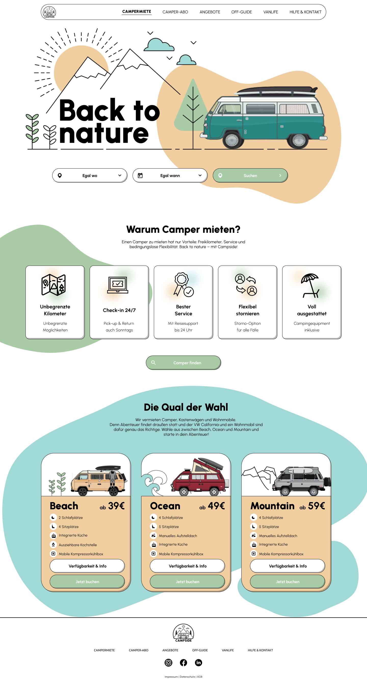

# Back to Nature - Landing Page

Demo:
https://snahmd.github.io/back-to-nature/

<hr/>



## Überblick

Dies ist ein responsives Projekt, das mit Tailwind CSS erstellt wurde. Es handelt sich um eine Landing Page für die Webseite "Back to Nature", die verschiedene Dienstleistungen rund um das Mieten von Campern anbietet.

## Inhaltsverzeichnis

1. [Verwendete Technologien](#verwendete-technologien)
2. [Projektstruktur](#projektstruktur)
3. [Installation](#installation)
4. [Verwendung](#verwendung)
5. [Responsive Design](#responsive-design)
6. [Danksagungen](#danksagungen)

## Verwendete Technologien

- HTML
- Tailwind CSS
- Google Fonts
- Figma

## Projektstruktur

```plaintext
├── assets
│   ├── img
│   │   ├── Logo.png
│   │   ├── Links.png
│   │   ├── Ilustration_Header_1.png
│   │   ├── SVG.png
│   │   ├── SVG-1.png
│   │   ├── SVG-2.png
│   │   ├── SVG-3.png
│   │   ├── ungebgrenzte KM.png
│   │   ├── ungebgrenzte KM-1.png
│   │   ├── ungebgrenzte KM-2.png
│   │   ├── ungebgrenzte KM-3.png
│   │   ├── ungebgrenzte KM-4.png
│   │   ├── Search.png
│   │   ├── Illustration Beach-1.png
│   │   ├── Illustration Ocean.png
│   │   ├── Illustration Mountain.png
│   │   ├── Link.png
│   │   ├── Link-1.png
│   │   ├── Link-2.png
│   │   ├── Link-3.png
│   │   ├── Link-4.png
│   │   ├── Instagram Circle.png
│   │   ├── Facebook.png
│   │   ├── LinkedIn Circled.png
│   │   ├── Logo-1.png
│   │   ├── BackgroundBulb.png
│   │   ├── Vector.png
│   ├── Landingpage.png
├── index.html
└── README.md
```

## Installation

1. Klonen Sie das Repository:

```Bash
git clone https://github.com/snahmd/back-to-nature.git
```

2. Wechseln Sie in das Projektverzeichnis:

```Bash
cd back-to-nature
```

3. Öffnen Sie die index.html Datei in Ihrem bevorzugten Webbrowser.

## Verwendung

- Die Webseite ist vollständig responsiv und passt sich an verschiedene Bildschirmgrößen an.
- Die Navigation erfolgt über ein einfaches Menü, das auf mobilen Geräten als Hamburger-Menü dargestellt wird.
- Die Hauptabschnitte der Webseite enthalten Informationen über die verschiedenen Camper-Typen und deren Vorteile.

## Responsive Design

Die Webseite wurde mit einem mobilen Ansatz erstellt und passt sich nahtlos an verschiedene Bildschirmgrößen an. Dank Tailwind CSS sind die Komponenten flexibel und können leicht angepasst werden.

## Impressum

Ein besonderes Dankeschön geht an die Entwickler und Designer, die zur Erstellung dieses Projekts beigetragen haben.

<hr/>
Wir hoffen, dass Ihnen dieses Projekt gefällt. Wenn Sie Fragen oder Anregungen haben, zögern Sie bitte nicht, uns zu kontaktieren.
